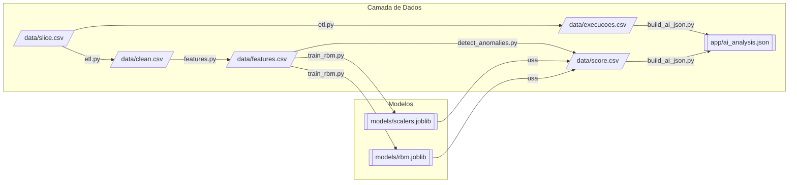

# Rundeck AI RBM — Detecção de Anomalias em Execuções

**Rundeck_AI_RBM** é um pipeline de **ETL → features → treino RBM → detecção → agregação** para identificar execuções anômalas (jobs/projetos) usando **Restricted Boltzmann Machine (RBM)**.  
O resultado final é um JSON canônico **`app/ai_analysis.json`** pronto para UI, APIs e alertas.

Repositório: `https://github.com/mbenedicto99/Rundeck_AI_RBM`

---

## ✨ Principais benefícios

- **Não supervisionado**: dispensa rótulos de anomalia (raros/caros).
- **Sinal contínuo**: o **erro de reconstrução (RE)** da RBM permite thresholds por projeto/job.
- **Aprende dependências**: captura padrões **não lineares** de coocorrência entre features (tempo, status, duração).
- **Operacionalizável**: saída em JSON padronizado, fácil de integrar a dashboards e automações.

---

## 🗺️ Arquitetura (n8n + pipeline)

### Visão completa (orquestração + scripts + artefatos)

```mermaid
flowchart TB
  %% ========= FONTES =========
  S0[(Fonte de dados<br/>Rundeck/Export)]
  S[/data/slice.csv/]

  %% ========= ORQUESTRAÇÃO =========
  subgraph N8N[Orquestração • n8n]
    direction TB
    Cron[[Cron (agendado)]] --> Exec[Execute Command<br/>source /home/node/venv/bin/activate; python scripts/pipeline.py]
    Webhook[[Webhook /run-pipeline]] -->|input, fileUrl| IF{fileUrl?}
    IF -- "sim" --> DL[HTTP Request (download)]
    DL --> WR[Write Binary File<br/>(/workspace/data/slice.csv)]
    IF -- "não" --> Exec
    WR --> Exec
  end

  S0 -->|Gera/atualiza| S
  S -. opcional (upload via Webhook) .-> WR
  Exec -->|INPUT_CSV=/workspace/data/slice.csv| ETL

  %% ========= CONTAINER / PIPELINE =========
  subgraph CTR[Container n8n-ai • venv /home/node/venv]
    direction LR
    ETL[etl.py<br/><sub>normaliza e enriquece</sub>] --> FEAT[features.py<br/><sub>escala p/ [0,1]</sub>] --> TRAIN[train_rbm.py<br/><sub>treina RBM</sub>] --> DET[detect_anomalies.py<br/><sub>erro de reconstrução (RE)</sub>] --> BUILD[build_ai_json.py<br/><sub>agrega resultados</sub>]
  end

  %% ========= ARTEFATOS =========
  S2[/data/slice.csv/]
  CL[/data/clean.csv/]
  EXE[/data/execucoes.csv/]
  FE[/data/features.csv/]
  MOD1[[models/scalers.joblib]]
  MOD2[[models/rbm.joblib]]
  SC[/data/score.csv/]
  OUT[[app/ai_analysis.json<br/>(final)]]

  %% ========= ENTRADAS/SAÍDAS POR ETAPA =========
  ETL <-- usa -- S2
  ETL --> CL & EXE

  FEAT <-- usa -- CL
  FEAT --> FE

  TRAIN <-- usa -- FE
  TRAIN --> MOD1 & MOD2

  DET <-- usa -- FE & MOD1 & MOD2
  DET --> SC
  DET -. opcional resumo .-> OUT

  BUILD <-- usa -- EXE & SC
  BUILD --> OUT

  %% ========= CONSUMIDORES =========
  UI[[Frontend / index.html]]
  API[[APIs / Integrações / n8n step]]

  OUT --> UI
  OUT --> API

  %% ========= NOTA RBM =========
  NOTE>Benefícios do RBM:<br/>• Não supervisionado (dispensa rótulos)<br/>• Aprende padrões não lineares<br/>• Score contínuo (RE) permite thresholds por job/projeto] --- OUT
```

### Mini-mapa (apenas fluxo de arquivos)



---

## 📁 Estrutura do projeto

```
.
├── app/
│   ├── ai_analysis.json        # saída final canônica
│   ├── anomalies.json          # (legado / opcional)
│   └── index.html              # exemplo simples de front
├── data/
│   ├── slice.csv               # entrada bruta
│   ├── clean.csv               # saída do ETL
│   ├── execucoes.csv           # normalizado p/ build final
│   ├── features.csv            # features em [0,1] + exec_id
│   └── score.csv               # exec_id + re (erro de reconstrução)
├── models/
│   ├── scalers.joblib          # scaler + colunas usadas
│   ├── rbm.joblib              # modelo RBM
│   └── feature_meta.json       # metadados (opcional)
├── n8n/
│   ├── Dockerfile(.alpine)     # base do container (Alpine/compila | Debian/wheels)
│   ├── docker-compose.yml
│   ├── start_n8n.sh / stop_n8n.sh
│   └── data/                   # estado do n8n (workflows/credenciais)
├── scripts/
│   ├── etl.py                  # -> clean.csv / execucoes.csv
│   ├── features.py             # -> features.csv
│   ├── train_rbm.py            # -> models/*
│   ├── detect_anomalies.py     # -> score.csv (+ json leve opcional)
│   ├── build_ai_json.py        # -> app/ai_analysis.json
│   ├── pipeline.py             # orquestrador local
│   └── simulate_data.py        # dados sintéticos para testes
├── requirements.txt
└── README.md
```

---

## ⚙️ Como funciona (etapas)

1) **ETL (`scripts/etl.py`)**  
   Entrada: `data/slice.csv` (separador `;` ou `,`).  
   Saída: `data/clean.csv` e `data/execucoes.csv` com:  
   `projeto, job, exec_id, inicio, status, duracao_s`.

2) **Features (`scripts/features.py`)**  
   Gera `data/features.csv` com `exec_id` +:
   - `duration_sec_mm`, `duration_z_clipped_mm`
   - codificação cíclica: `hour_sin_mm`, `hour_cos_mm`, `wday_sin_mm`, `wday_cos_mm`
   - flags: `failed` (status==failed), `high_runtime` (p95 por projeto+job)

3) **Treino (`scripts/train_rbm.py`)**  
   Salva `models/scalers.joblib` (MinMax + colunas) e `models/rbm.joblib` (RBM).

4) **Detecção (`scripts/detect_anomalies.py`)**  
   Calcula **RE** (erro de reconstrução) com a RBM → `data/score.csv` (`exec_id,re`).

5) **Agregação (`scripts/build_ai_json.py`)**  
   Junta `execucoes.csv + score.csv` e produz `app/ai_analysis.json` com:
   - `resumo` (contagens, duração média, `re_p95_global`)
   - `risco_p95_por_job` (p95 de RE por projeto+job)
   - `hotspots` (top n execuções com maior RE)

---

## 🚀 Quickstart (local)

```bash
python3 -m venv .venv
source .venv/bin/activate
pip install -U pip
pip install -r requirements.txt

# Coloque seu arquivo de origem em data/slice.csv
python scripts/pipeline.py

# Ver o resumo
jq '.resumo' app/ai_analysis.json
```

Variáveis úteis (opcionais):
- `INPUT_CSV=data/slice.csv python scripts/etl.py`
- `OUTPUT_CSV=data/clean.csv`
- `EXECUCOES_CSV=data/execucoes.csv`

---

## 🕹️ Orquestração com n8n

### Subir (Docker)

Na pasta `n8n/`:

```bash
# preparar permissões
mkdir -p ./data && sudo chown -R 1000:1000 ./data

# build & up (escolha Dockerfile ou Dockerfile.alpine)
docker compose build --no-cache
docker compose up -d

# criar venv e instalar deps dentro do container
docker exec -it n8n-ai bash -lc '
python3 -m venv /home/node/venv
source /home/node/venv/bin/activate
pip install -U pip
pip install -r /workspace/requirements.txt
'
```

UI: `http://localhost:5678` (credenciais no `docker-compose.yml` / `.env`).

> **Nota Alpine:** se usar `Dockerfile.alpine`, pode ser necessário compilar `scikit-learn` (lento). Scripts auxiliares no diretório `scripts/` e `n8n/` cobrem esse cenário. **Debian é recomendado** se quiser apenas wheels.

### Job agendado (Cron)
**Execute Command → Command**:
```bash
set -euo pipefail
source /home/node/venv/bin/activate
cd /workspace
INPUT_CSV=/workspace/data/slice.csv python scripts/pipeline.py
```
**Options → Timeout**: ajuste conforme volume (ex.: 600000 ms).

### Job on-demand (Webhook)
- **Webhook** (`/run-pipeline`) com `GET/POST`
- (Opcional) **HTTP Request** baixa CSV de `fileUrl` → **Write Binary File** em `/workspace/data/slice.csv`
- **Execute Command**:
  - **Command**:
    ```bash
    set -euo pipefail
    source /home/node/venv/bin/activate
    cd /workspace
    python scripts/pipeline.py
    ```
  - **Options → Environment Variables**:
    - Name: `INPUT_CSV`
    - Value (Expression): `={{$json.input || "/workspace/data/slice.csv"}}`
- **Read Binary File** `/workspace/app/ai_analysis.json` → **Respond to Webhook**

Testes:
```bash
# GET simples
curl "http://<IP>:5678/webhook/run-pipeline"

# POST (troca o input)
curl -X POST "http://<IP>:5678/webhook/run-pipeline"   -H "Content-Type: application/json"   -d '{"input":"/workspace/data/slice.csv"}'
```

---

## 📦 Formatos de dados

### `data/execucoes.csv` (ETL)
| coluna     | tipo     | descrição                                  |
|------------|----------|---------------------------------------------|
| projeto    | str      | projeto/folder                              |
| job        | str      | nome do job                                 |
| exec_id    | str      | id único da execução                        |
| inicio     | datetime | início                                      |
| status     | str      | `success`/`failed`/…                        |
| duracao_s  | float    | segundos                                    |

### `data/features.csv`
| coluna                  | tipo  | obs                                           |
|-------------------------|-------|-----------------------------------------------|
| exec_id                 | str   | chave                                         |
| duration_sec_mm         | float | min–max global                                |
| duration_z_clipped_mm   | float | z-score clipado [-3,3] → [0,1]                |
| hour_sin_mm/hour_cos_mm | float | codificação cíclica 24h                       |
| wday_sin_mm/wday_cos_mm | float | codificação cíclica 7 dias                    |
| failed                  | int   | 1 se status==failed                           |
| high_runtime            | int   | 1 se duração > p95 por projeto+job            |

### `data/score.csv`
| coluna  | tipo  | descrição                       |
|---------|-------|----------------------------------|
| exec_id | str   | chave                            |
| re      | float | erro de reconstrução da RBM      |

### `app/ai_analysis.json`
```json
{
  "resumo": {
    "total_execucoes": 1234,
    "por_status": {"success": 1200, "failed": 34},
    "duracao_media_s": 42.1,
    "re_p95_global": 0.031
  },
  "risco_p95_por_job": [
    {"projeto":"A","job":"X","re_p95":0.06}
  ],
  "hotspots": [
    {"projeto":"A","job":"X","exec_id":"...","inicio":"2025-09-18T10:10:10","status":"success","duracao_s":55.0,"re":0.08}
  ],
  "top_amostras": [ ... ]
}
```

---

## 🧠 RBM em 30 segundos

- **BernoulliRBM (sklearn)**: modelo energético não supervisionado.
- **Entrada**: features em **[0,1]** (já normalizadas em `features.py`).
- **Sinal**: **RE = mean((V − V_recon)²)**, onde `V_recon = rbm.gibbs(V)`.
- **Interpretação**: RE alto → execução pouco “explicável” pelo padrão aprendido → candidata a anomalia.  
  Use `re_p95_global` e `re_p95_por_job` para limiares e priorização.

---

## 🧪 Dados sintéticos (teste)

```bash
python scripts/simulate_data.py > data/slice.csv
python scripts/pipeline.py
jq '.resumo' app/ai_analysis.json
```

---

## 🛠️ Troubleshooting

- **Coluna obrigatória ausente em `execucoes.csv`**  
  Verifique o ETL: precisa gerar `projeto, job, exec_id, inicio, status, duracao_s`.

- **MinMaxScaler: Found array with 0 sample(s)**  
  `features.csv` vazio → confira `clean.csv` e o parsing do `slice.csv`.

- **No n8n: `ModuleNotFoundError: pandas`**  
  Dentro do container:
  ```bash
  docker exec -it n8n-ai bash -lc 'source /home/node/venv/bin/activate && pip install -r /workspace/requirements.txt'
  ```

- **Alpine pedindo gcc/meson**  
  Use `Dockerfile.alpine` + script de build (compila `scikit-learn` com `SKLEARN_NO_OPENMP=1`).  
  Se não quiser compilar, use a imagem **Debian**.

- **Permissão `/home/node/.n8n/config`**  
  No host: `sudo chown -R 1000:1000 n8n/data && docker compose up -d`.

---

## 🔐 Boas práticas

- Paths canônicos: `data/`, `models/`, `app/`.
- `exec_id` estável entre etapas.
- Se expor Webhook, **autentique** (Basic/Auth token) e restrinja por rede.
- Faça **backup** de `n8n/data` (workflows/credenciais).

---

## 🤝 Contribuindo

1. Crie uma branch a partir de `main`.  
2. Commits pequenos e descritivos.  
3. PR com descrição do problema/solução e passos de teste.

---

## 📤 Publicar no GitHub

```bash
cd ~/Documents/CanopusAI/RUNDECK_AI
git init
git remote add origin git@github.com:mbenedicto99/Rundeck_AI_RBM.git
git checkout -b main
git add .
git commit -m "docs: README completo + pipeline RBM"
git push -u origin main
```

> HTTPS: `git remote add origin https://github.com/mbenedicto99/Rundeck_AI_RBM.git`

---

## 📄 Licença

Escolha e adicione `LICENSE` (ex.: MIT).
