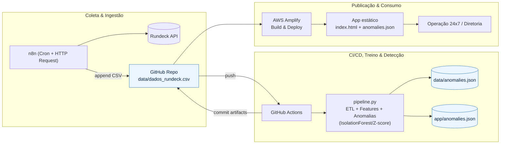

# ESTEIRA_RUNDECK_AI.md — MLOps para Anomalias em Jobs do Rundeck (n8n + GitHub + Amplify)

## 1) Objetivo
Detectar **falhas e anomalias** nas execuções de jobs do Rundeck e publicar uma visão executiva em tempo quase real, usando **n8n** para coleta, **GitHub** para versionamento/CI e **AWS Amplify** para publicação do front-end estático.

## 2) Arquitetura & Fluxo

**Pontos-chave**
- **Dados brutos** em `data/dados_rundeck.csv` (coletados pelo n8n).
- **Artefatos de inferência** em `app/anomalies.json` servidos pelo Amplify.
- **CI/CD** dispara a pipeline a cada push (ou manualmente via `workflow_dispatch`).

## 3) Fluxo da Esteira (passo a passo)
1. **n8n (Coleta):**
   - Trigger **Cron** (ex.: de hora em hora).
   - **HTTP Request** → `GET {RUNDECK_BASE_URL}/api/38/executions?max=200&project={RUNDECK_PROJECT}` com header `X-Rundeck-Auth-Token`.
   - **Function** (map) → transformar JSON em linhas (execution_id, projeto, job, início/fim, status, duração, recursos, erro).
   - **GitHub** (create/update file) → *append* em `data/dados_rundeck.csv` (commit com mensagem padrão).
2. **GitHub Actions (Detecção):**
   - `on: push` → roda `scripts/pipeline.py`.
   - **ETL + Features**; **IsolationForest** (se disponível) com fallback **Z-score** por job e global.
   - Gera `app/anomalies.json` (e cópia em `data/`), commita e faz push.
3. **AWS Amplify (Publicação):**
   - Monitorando o repositório (branch `main`), **build + deploy** da pasta `app/`.
   - **index.html** lê `anomalies.json` e oferece filtro simples (projeto/job/status).

## 4) Estrutura de Repositório (proposta)
```
/
  app/
    index.html           # Front-end estático (Amplify)
    anomalies.json       # Gerado pela pipeline (não editar manualmente)
  data/
    dados_rundeck.csv    # Coleta (n8n) ou simulação
    anomalies.json       # Cópia para auditoria
  n8n/
    workflow_rundeck_to_github.json  # Export do fluxo n8n (opcional)
  scripts/
    etl.py               # Load/clean/parse
    features.py          # Enriquecimento (dow/hour/weekend/etc.)
    train_isoforest.py   # (opcional) Modelo IsolationForest
    detect_anomalies.py  # Z-score + serialização anomalies.json
    pipeline.py          # Orquestra: simula (se preciso) → detecta → grava artefatos
    simulate_data.py     # Gera dados sintéticos p/ teste
  .github/workflows/
    mlops.yml            # CI/CD
  requirements.txt
  .env.example
  README.md
```

## 5) Variáveis de Ambiente
- `RUNDECK_BASE_URL` — URL do Rundeck (ex.: `https://rundeck.example.com`)
- `RUNDECK_API_TOKEN` — token de API (Header: `X-Rundeck-Auth-Token`)
- `RUNDECK_PROJECT` — projeto padrão (ex.: `default`)
- `ANOMALY_THRESHOLD` — Z-score (padrão `3.0`); para IsolationForest, usar `IFOREST_CONTAMINATION` (ex.: `0.03`)
- **GitHub Actions/Amplify**: exportar as mesmas variáveis quando necessário

## 6) n8n (nós mínimos)
- **Cron**: periodicidade (hora, 30 min, etc.).
- **HTTP Request (Rundeck)**: GET, headers com token.
- **Function (map)**: normaliza campos (id, horários ISO-8601, status, duração, erros, CPU/MEM/queue se houver).
- **GitHub (file upsert/append)**: escreve/atualiza `data/dados_rundeck.csv` com commit automático.

> Observação: Caso a API do Rundeck retorne muito volume, paginar por `max`/`offset` e limitar à janela desejada (últimas N execuções).

## 7) CI/CD (GitHub Actions)
- **Setup Python 3.11** + `pip install -r requirements.txt`.
- Executa `python scripts/pipeline.py`.
- **Commit** de `app/anomalies.json` e `data/anomalies.json` (idempotente).

### Resumo de lógica de detecção
- **Sinais básicos**: `duration_sec`, `status`, `retries`, `queue_depth`, `cpu_pct`, `mem_pct`, `dow/hour/is_weekend`.
- **Z-score**: outlier de duração por `job_project` + global; marca falhas explícitas (`status != succeeded`).
- **IsolationForest (opcional)**: maior robustez para multivariáveis; `contamination ~ 3%` como padrão inicial.

## 8) Front-end (Amplify)
- Páginas estáticas (`app/`).
- `index.html` lê `anomalies.json` e exibe tabela com **filtros** por texto.
- Pode-se evoluir para gráficos de tendência (por job/projeto) e export CSV.

## 9) Simulação de Dados (para validação)
- `python scripts/simulate_data.py` → cria `data/dados_rundeck.csv` com 90 dias, sazonalidade semanal + picos mensais + falhas/timeout.
- `python scripts/pipeline.py` → gera `app/anomalies.json` e `data/anomalies.json`.

## 10) Operação, Qualidade & Alertas
- **Métricas**: % anomalias por dia/job, MTTR estimado, taxa de falhas por horário, jobs mais críticos.
- **Alertas**: opcional acionar n8n → e-mail/Slack quando `anomalies.json` acima de `X` itens no dia.
- **Auditoria**: manter `data/` versionado; `anomalies.json` com timestamp e `execution_id`.
- **SLO inicial**: atualização do painel ≤ 15 min após a execução do job.

## 11) Próximos Passos
1. Criar repositório GitHub e **habilitar Amplify** (branch `main`, pasta `app/`).  
2. Importar workflow no **n8n** e setar credenciais/envs.  
3. Adicionar **GitHub Actions** (`.github/workflows/mlops.yml`).  
4. Rodar simulação local + primeiro push.  
5. Validar `anomalies.json` no site do Amplify e ajustar limiares/modelos.
